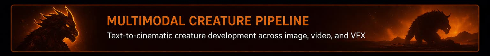
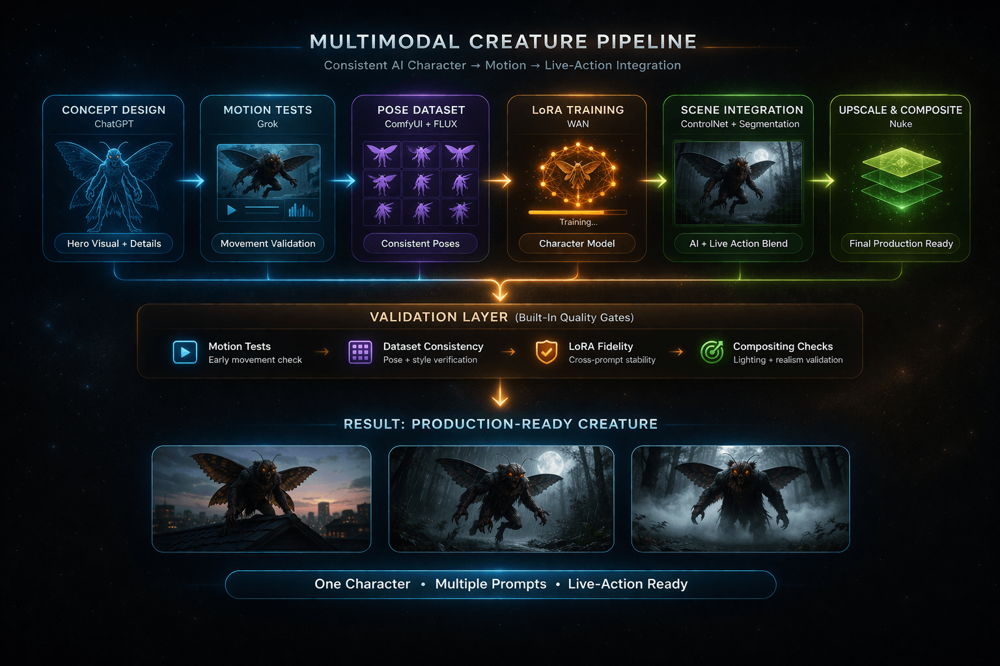
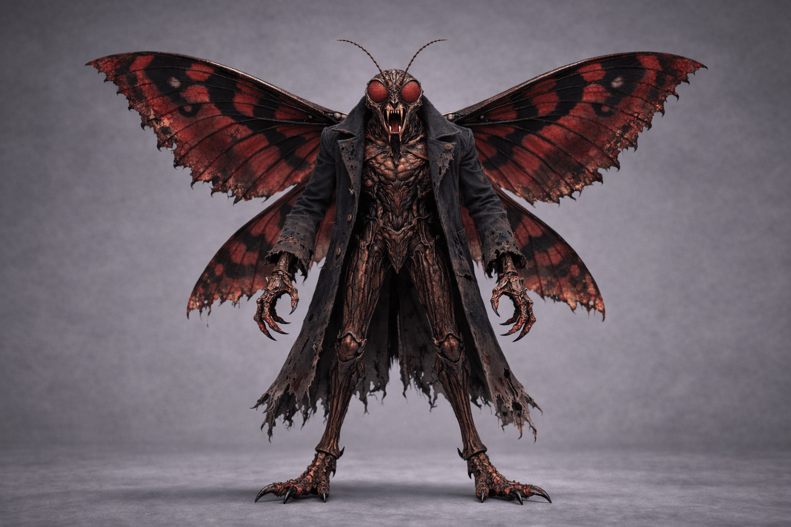
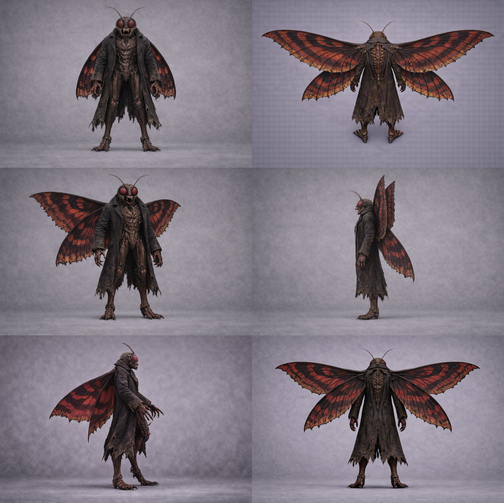
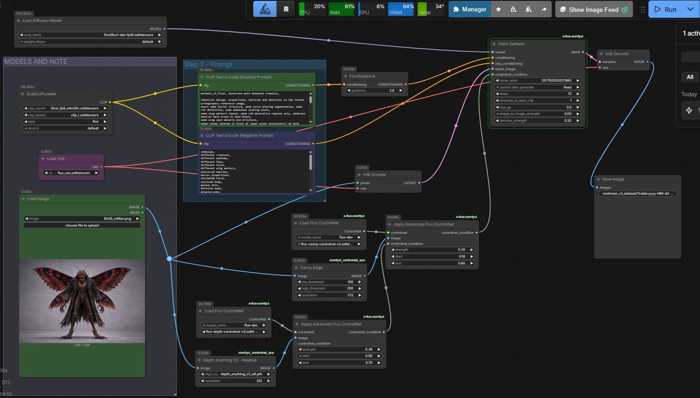
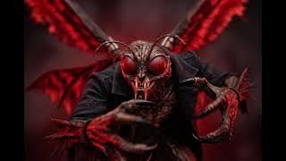
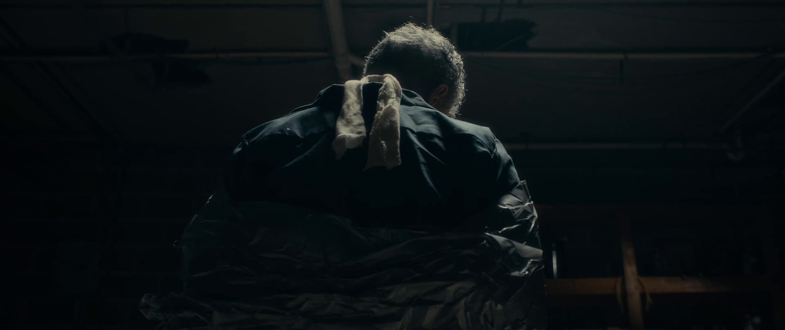

# Mothman — LoRA Creature Workflow



## Overview

*Mothman* is a production-oriented AI creature pipeline built to test whether a consistent character can be designed, trained, deployed, and integrated across multiple shots using a combination of generative tools and traditional VFX techniques.

The project focuses on a core problem in AI-driven production workflows: maintaining character identity across different poses, scenes, and downstream applications. Rather than treating generation as a one-off output, this workflow treats the creature as a reusable system asset.

---

## Objective

Create a consistent AI-generated creature and deploy it through a structured workflow that supports:

* controlled concept development
* dataset-driven consistency
* LoRA-based identity preservation
* multi-scene application
* integration into live-action compositing workflows

---

## Final Outputs

* [Insert link to final test videos]
* [Insert link to composited final shot]

---

## Workflow Summary

The pipeline is organized into five major stages:

1. Creature concept design
2. Dataset creation
3. LoRA training
4. Multi-scene LoRA deployment
5. Live-action integration and compositing

---

## System Overview



The workflow translates a creature concept into a reusable production asset through a staged pipeline of design, training, validation, and integration.

---

## Concept Development



The pipeline begins with a defined hero design used as the visual anchor for all downstream steps. The goal at this stage is not broad exploration, but selection of a stable identity that can support dataset creation and training.

This design functions as the canonical reference for the creature’s silhouette, surface qualities, proportions, and visual tone.

---

## Dataset Creation



A curated pose dataset was generated to support LoRA training. Images were produced with controlled lighting and neutral presentation in order to emphasize character identity over environmental variation.

Dataset creation focused on:

* preserving core anatomical features
* exploring pose variation without losing identity
* generating enough coverage to support reuse across later scenes

This step converts a single concept into a trainable character system.

---

## Training Workflow



LoRA training was used to encode the creature’s visual identity into a reusable model layer.

The workflow was designed to support two related goals:

* **Image consistency** — preserving identity across generated stills
* **Downstream reuse** — enabling deployment into motion and integration workflows

Rather than relying on prompt repetition alone, the system uses training to stabilize appearance across outputs.

---

## LoRA Deployment Across Scenes

<table>
<tr>
<th align="center" colspan="3">Multi-Scene LoRA Tests</th>
</tr>
<tr>
<td align="center" bgcolor="#3f4a54">
<a href="https://youtu.be/T57d_ERXKjU" target="_blank">

</a><br/><sub>Scene Test 01</sub>
</td>
<td align="center" bgcolor="#3f4a54">
<a href="https://youtu.be/D1O6J3-mofQ" target="_blank">

</a><br/><sub>Scene Test 02</sub>
</td>
<td align="center" bgcolor="#3f4a54">
<a href="https://youtu.be/jxlbnHHw_D4" target="_blank">

</a><br/><sub>Scene Test 03</sub>
</td>
</tr>
</table>

After training, the LoRA was applied across multiple scenes to test whether the creature could maintain identity under different framing, motion, and scene conditions.

This stage functions as validation rather than simple output generation. The goal is to confirm that the trained character behaves as a portable system asset rather than a one-shot image style.

---

## Live-Action Integration

<table>
<tr>
<th align="center" colspan="3">Before / After Integration</th>
</tr>
<tr>
<td align="center" bgcolor="#3f4a54">

<br/><sub>Live-Action Plate</sub>
</td>
<td align="center" width="80">
<h2>➜</h2>
</td>
<td align="center" bgcolor="#3f4a54">

<br/><sub>Final Composite</sub>
</td>
</tr>
</table>

The final stage integrates the creature into a live-action shot using a hybrid AI + VFX workflow.

Key techniques include:

* **ControlNet** for spatial guidance and scene alignment
* **Segmentation** for matte generation and compositing prep
* **Traditional compositing** to control lighting, placement, and final shot integration

This transforms the trained creature from a generated subject into a production-ready element.

---

## Narrative and Production Value

This project demonstrates more than creature generation. It shows how a character can move through a structured production pipeline:

* from concept
* to dataset
* to trained identity system
* to scene deployment
* to final integrated shot

That progression is the core value of the workflow. The creature is not treated as a static image result, but as a reusable multimodal asset.

---

## Tools and Technologies

* ChatGPT — concept development and prompt structuring
* ComfyUI — image generation and workflow control
* FLUX / related image models — dataset generation
* LoRA training workflows — identity preservation
* ControlNet — guided placement and scene conditioning
* Segmentation workflows — compositing support
* Nuke — final integration and shot finishing

---

## Challenges

* Maintaining creature identity across multiple poses and scenes
* Building a dataset that balances consistency with useful variation
* Stabilizing downstream outputs beyond prompt-only methods
* Integrating AI-generated elements into live-action plates without breaking realism

---

## Key Takeaways

* LoRA enables identity persistence beyond what prompt-only generation can reliably achieve
* Dataset design is a foundational creative and technical step, not just a training prerequisite
* Validation across multiple scenes is necessary to confirm whether a character is truly reusable
* AI creature workflows become production-relevant when they connect generation, training, and integration into one system

---

## Repository Structure

```
/images/flows     # pipeline diagrams
/images/headers   # header and hero images
/images/mothman   # concept, dataset, training, and integration assets
```

/images      # concept art, datasets, thumbnails, diagrams

```

---

## Notes

This repository is intended as a focused case study in AI-driven creature pipeline design, with an emphasis on LoRA-based consistency and production integration.

```
